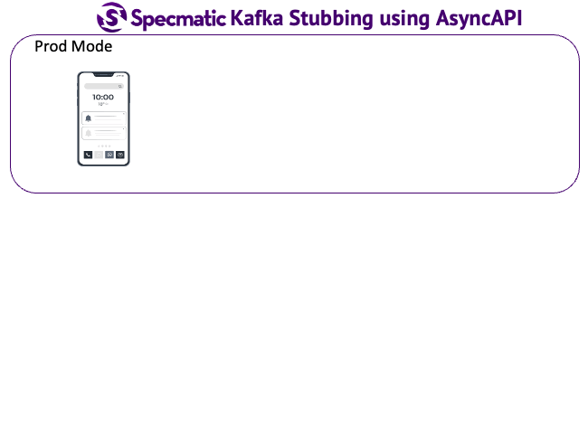
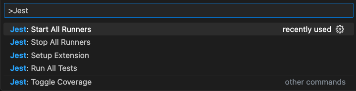
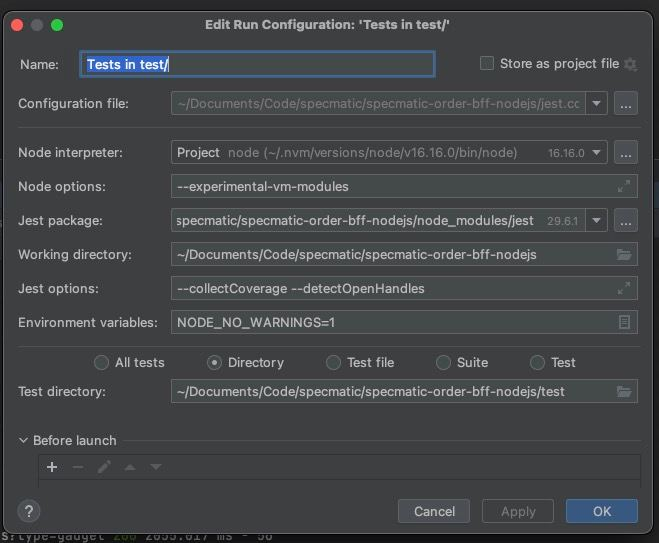

# Specmatic Sample: NodeJS BFF calling Domain API


<!-- TOC -->
- [Background](#background)
- [Tech](#tech)
- [Run Contract Tests](#run-contract-tests)
  - [Using npm](#using-npm)
- [For More Info](#for-more-info)
<!-- /TOC -->

## Background
This sample demonstrates contract-driven development for a Node.js backend-for-frontend (BFF) that orchestrates product search by delegating to the Specmatic Order Domain API and publishing Kafka messages. Specmatic virtualizes both downstream dependencies during testing so the BFF can be tested in isolation.

The specifications consumed by `specmatic.yaml` are maintained in the [specmatic-order-contracts](https://github.com/specmatic/specmatic-order-contracts) repository:
- [Domain API OpenAPI specification](https://github.com/specmatic/specmatic-order-contracts/blob/main/io/specmatic/examples/store/openapi/api_order_v3.yaml)
- [Kafka AsyncAPI specification](https://github.com/specmatic/specmatic-order-contracts/blob/main/io/specmatic/examples/store/asyncapi/kafka.yaml)



## Tech
1. NodeJS + Express
2. JRE 17+
3. Specmatic
4. Jest & SuperTest
5. Docker

## Run Contract Tests
Contract tests configure Specmatic using `specmatic.yaml` to fetch the shared specifications, start an HTTP stub for the Domain API, and virtualize Kafka. Ensure Docker Desktop is running because the Kafka mock runs in a container.

### Using npm
```shell
npm install
npm test
```
`npm test` launches the BFF, spins up Specmatic HTTP and Kafka mocks, and executes the Jest contract suite with API coverage reporting. Review the generated report at `reports/specmatic/html/index.html`.

## Troubleshooting
1. Specmatic contract tests don't show up in VSCode Test Explorer

   Specmatic is tested with projects using Jest framework. If you are using any other framework then let us know and we will revert with a solution. In case of jest, if contract tests don't show up, then try restarting the jest runners
   

2. Specmatic contract tests don't run in Jetbrain's PhpStorm

   Jetbrain's PhpStorm does not read `test` script in package.json to determine the command to run tests. It instead uses its own interface to configure all the options. You can configure the same options in the test script in package.json, in PhpStorm's test run configuration as below
    - `test` script in package.json
    ```json
    {
        ...
        "test" : "cross-env SPECMATIC_GENERATIVE_TESTS=true NODE_OPTIONS=--experimental-vm-modules NODE_NO_WARNINGS=1 node ./node_modules/jest/bin/jest.js --collectCoverage --detectOpenHandles"
        ...
    }
    ```
    - Above configured in PhpStorm
       <br>

## For More Info
- [Specmatic Website](https://specmatic.io)
- [Specmatic Documentation](https://docs.specmatic.io)
