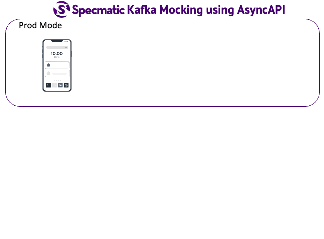
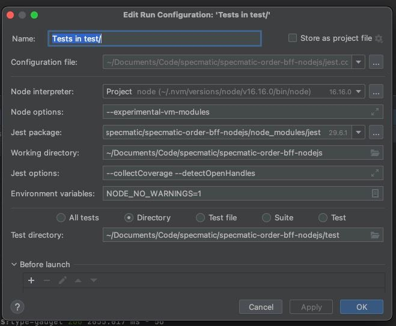

# Specmatic Sample: NodeJS BFF calling Domain API


* [Specmatic Website](https://specmatic.in)
* [Specmatic Documentation](https://specmatic.in/documentation.html)

This sample project demonstrates how we can practice contract-driven development and contract testing in a NodeJS application that depends on an external domain service and Kafka. Here, specmatic is used to stub calls to domain API service based on its OpenAPI spec and mock Kafka based on its AsyncAPI spec.

Here is the [OpenAPI spec](https://github.com/znsio/specmatic-order-contracts/blob/main/in/specmatic/examples/store/api_order_v3.yaml) of the domain API that defines the API endpoints, its request parameters and response along with their schema.

Here is the [AsyncAPI spec](https://github.com/znsio/specmatic-order-contracts/blob/main/in/specmatic/examples/store/kafka.yaml) of Kafka that defines the topics and message schema.

## Definitions
* BFF: Backend for Front End
* Domain API: API managing the domain model
* Specmatic Stub/Mock Server: Create a server that can act as a real service using its OpenAPI or AsyncAPI spec

## Background
A typical web application might look like this. We can use Specmatic to practice contract-driven development and test all the components mentioned below. In this sample project, we look at how to do this for nodejs BFF which is dependent on Domain API Service and Kafka demonstrating both OpenAPI and AsyncAPI support in specmatic.



## Tech
1. NodeJS + Express
2. JRE 17+
3. Specmatic
4. Specmatic Beta extension (for mocking Kafka)
5. Jest & SuperTest

### Install Dependencies
1. Run `npm install`
2. Run `npm install git+https://github.com/znsio/specmatic-node-beta.git#<version>`. Replace `<version>` with the correct version from package.json.

### Start BFF Application
This will start the main nodejs application providing backend service for frontend (BFF)
```shell
npm start
```
Access find orders API at http://localhost:3000/findAvailableProducts. This is used to demo HTTP stubbing using OpenAPI and Kafka mocking using AsyncAPI<br>

_**Note:** Unless domain API service and Kafka mocks are running, the above requests will fail. Move to the next section for the solution!_

### Start BFF Server with Dependencies (Domain API Stub and Kafka Mock Servers)
This will start the nodejs based BFF server with domain API stubbed using Specmatic HTTP stub server and Kafka mocked using Specmatic Kafka mock server to demonstrate workings of the stub server
```shell
npm run startWithDeps
```
Access the find orders API at http://localhost:3000/findAvailableProducts **with a header of pageSize: number**. The result should be like
```json
[{"id":698,"name":"NUBYR","type":"book","inventory":278}]
```

### Run Tests
This will start the Specmatic HTTP stub server for domain API and Specmatic Kafka mock server using the information in specmatic.json and run tests to validate BFF APIs.
```shell
npm run test
```

## Troubleshooting
1. Specmatic contract tests don't show up in VSCode Test Explorer
   
   Specmatic is tested with projects using Jest framework. If you are using any other framework then let us know and we will revert with a solution. In case of jest, if contract tests don't show up, then try restarting the jest runners
   

2. Specmatic contract tests don't run in Jetbrain's PhpStorm

    Jetbrain's PhpStorm does not read `test` script in package.json to determine the command to run tests. It instead uses its own interface to configure all the options. You can configure the same options in the test script in package.json, in PhpStorm's test run configuration as below
    - `test` script in package.json
    ```json
    {
        ...
        "test" : "cross-env SPECMATIC_GENERATIVE_TESTS=true NODE_OPTIONS=--experimental-vm-modules NODE_NO_WARNINGS=1 node ./node_modules/jest/bin/jest.js --collectCoverage --detectOpenHandles"
        ...
    }
    ```
    - Above configured in PhpStorm
     <br>
